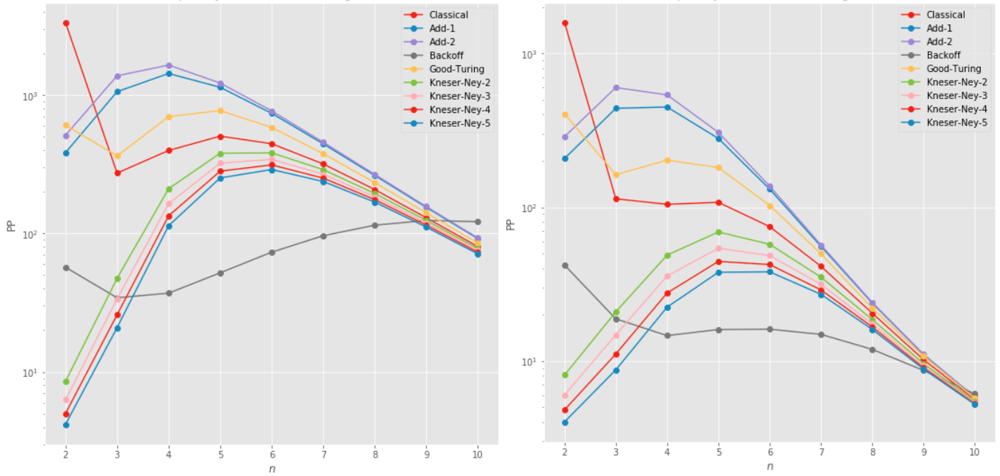
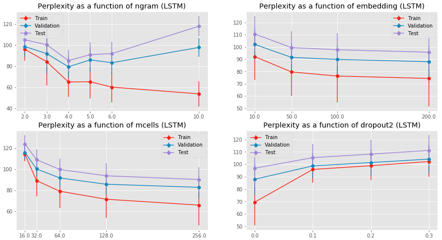

# Natural Language Processing: Language Modeling

This repository provides our work done as part of the ENSAE lecture (spring 2019): "Natural Language Processing" taught by Édouard Grave & Armand Joulin (Facebook AI Research). For this project, we chose to study **language modeling**. Language modeling goal is to assign probability to a text. LM is used in speech recognition, machine translation, Optical Character Recognition (OCR), handwriting recognition, information retrieval, etc... 

## Guidelines

This project allows to look over the different models encountered in language modeling, from the most basic ones to deepest models. We focused on word level models. To this extent, we have implemented:
- **n-gram models and their variations (smoothing, backoff, interpolation)**
- **recurrent deep networks (RNN, LSTM, GRU, BiLSTM, etc...)**
- **text generation algorithms**

Regarding the implementation, we made the choice to code n-gram LM models **from scratch** and use **Keras** library for deep networks. 

## Objective

The goal of this project is to study and compare the different approaches. To do so, we consider the 2 word level datasets available (`wiki` and `tatoeba`). The models are compared according to their perplexity on validation (tuning) and test (unseen sequences). The perplexities are computed over the full datasets, not averaged per sentence. Finally, we have also tested those models on text generation tasks (see below the application of LM to text generation, source: https://ofir.io/Neural-Language-Modeling-From-Scratch/).

## Structure
### `utils.py`

This file contains useful functions to run the code properly. 

### `ngram.py`

This file contains the implementation of classical n-gram method and its variations: Laplace smoothing, Turing smoothing, stupid backoff, Kneser-Ney interpolation.

### `recurrentNets.py`

This file contains the implementation (with Keras) of deep recurrent networks (RNN, LSTM, GRU, BiLSTM and BiLSTM-Conv2D). The embeddings are rather learned or pre-trained using Fast-Text (A. Joulin, E. Grave, P. Bojanowski, M. Douze, H. Jégou, T. Mikolov, "FastText.zip: Compressing text classification models", 2016, see https://github.com/facebookresearch/fastText for details). 

### `experiments.ipynb`

This notebook reproduces our experiments. It is the only file you should run. We used Google Colab which offers the possibility to work on GPU (one Tesla K80).

### Folder `Data`

This folder contains the data set used for this project: `tatoeba` and `wiki`.

### Folder `Models`

This folder contains one of the best models selected (yaml + hd5 format). **Beware: because of memory size limits, the models can be found here: https://drive.google.com/open?id=1BrFMfl1iDGwBfhyzlzf6VDJoVGfHL38D. For the last part of the experiments, you will need to load the best selected models. Instructions are given at the beginning of the notebook.

### Folder `Checkpoints`

This folder aims at storing the checkpoints from training.

### Folder `Results`

This folder contains the metrics evaluations for all models fitted during the fine-tuning phase.

## Experiments

The experiments can be reproduced from A to Z on CPU or GPU. The first cells of our notebook concern the use of Colab and GPU. **If you intent to use Colab, the only requirement is to create a folder `NLP` in your drive, download the notebook (or simply click on 'Open in Colab' on top-left corner) and run the first cell.** 

For more convenience, please consult the following **nbViewer link**: 

https://nbviewer.jupyter.org/github/afiliot/Language-modeling/blob/master/experiments.ipynb

## Results

Here are some results obtained on `tatoeba` data set: 

- The evolution of perplexity on `tatoeba` test sets as a function of length of n-grams (left: validation, right: test):

- The values of perplexities on both test sets as a function of length of n-grams (normal: `tatoeba`, parenthesis: `wiki`):

| Models \ n  | 2           | 3          | 4          | 5          |
|-------------|-------------|------------|------------|------------|
| Classic     | 1589 (3343) | 113 (282)  | 104 (409)  | 108 (526)  |
| Add-1       | 207 (396)   | 439 (1071) | 448 (1454) | 280 (1155) |
| Add-2       | 287 (521)   | 600 (1394) | 538 (1668) | 307 (1236) |
| Backoff     | 42 (57)     | 19 (34)    | 15 (38)    | 16 (54)    |
| Good-Turing | 404 (624)   | 163 (363)  | 202 (720)  | 181 (805)  |
| KSN-2       | 8 (9)       | 21 (50)    | 50 (218)   | 69 (395)   |
| KSN-3       | 6 (6)       | 15 (35)    | 36 (170)   | 54 (336)   |
| KSN-4       | 5 (5)       | 11 (27)    | 28 (140)   | 44 (295)   |
| KSN-5       | 4 (4)       | 9 (22)     | 22 (118)   | 39 (264)   |

- The evolution of perplexity according to some parameters of LSTM networks:

- The perplexities and accuracies - in predicting next words - obtained on fine-tuned deep networks for `tatoeba` data set (normal script: fast-text 300-sized embeddings | parenthesis: learned 200-sized embeddings | bold: best between the 2 | blue: best on test set | red: best on validation set):

| Models       | Train acc. | Val acc. | Test acc. | Train PP. | Val PP. | Test PP. |
|--------|------------|----------|-----------|-----------|---------|----------|
| LSTM   | 32.2% (**32.7%**)     |   28.2% (**28.7%**) |   28.0% (**28.7%**)  |  **39.0** (39.6)    |  **62.0** (64.1)  |  **67.4** (70.3)   |
| BiLSTM | 32.1%  (**34.2%**)    |  28.1% (**29.0%**)  |   27.9% (**28.5%**)  |  36.4 (**34.9**)    |  **59.2** (61.4)  |   **63.7**  (67.8)   |
| RNN    | **32.1%** (31.0%)    |  **27.5%** (27.4%)  |   27.5% (27.5%)  |  **41.1** (47.2)    |  67.3 (**66.5**)  |  73.4 (**71.1**)   |
| GRU    |  **33.6% (31.9%**)    |  28.6% (**28.7%**)  |   28.3% (**28.4%**)  |  **34.8** (43.7)    |  **61.2**  (61.7)  |  67.5 (**66.7**)   |
| FF     |  28.4% (**28.9%**)    | 26.3%  (**26.8%**)  |   26.3% (**26.6%**)  |  76.5 (**74.7**)    |  **103.4** (104.7)  |  118.2 (**117.0**)   |
| BiLSTMCNN |  **33.4%** (30.4%)    |  **27.8%** (27.4%)  |   **27.6%** (27.1%)  |  **30.9** (43.0)    |  **66.0** (66.2)  |  71.6 (**70.8**)   |

- The perplexities and accuracies - in predicting next words - obtained on fine-tuned deep networks for `wiki` data set (blue: best on test set | red: best on validation set):

| Models       | Train acc. | Val acc. | Test acc. | Train PP. | Val PP. | Test PP. |
|--------|------------|----------|-----------|-----------|---------|----------|
| LSTM   | 28.4%     |   26.9% |   26.5%  |  111.8    |  155.4  |  157.6   |
| BiLSTM |  28.3%    |  26.5%  |   26.3%  |  102.9    |  144.3  |   145.2    |
| RNN    |  26.1%    |  25.1%  |   24.9%  |  138.7    |  172.1  |  174.5   |
| GRU    |  27.3%    |  26.3%  |   25.7%  |  127.2    |  161.5  |  162.4   |
| FF     |  22.7%    |  23.1%  |   22.2%  |  472.0    |  513.3  |  594.0   |
| BiLSTMCNN |  28.7%    |  26.3%  |   25.9%  |  94.2    |  167.1  |  166.4   |
